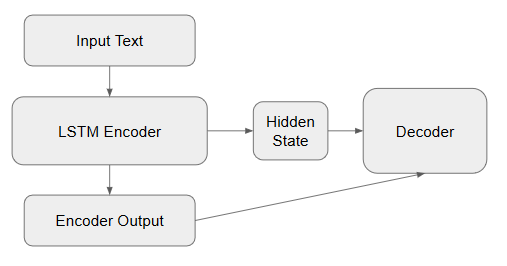
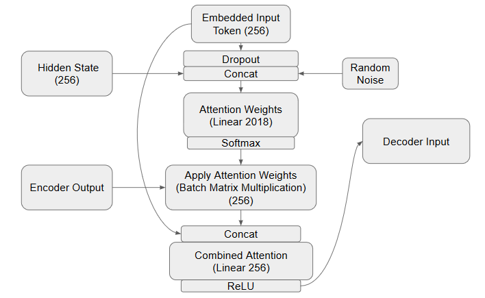
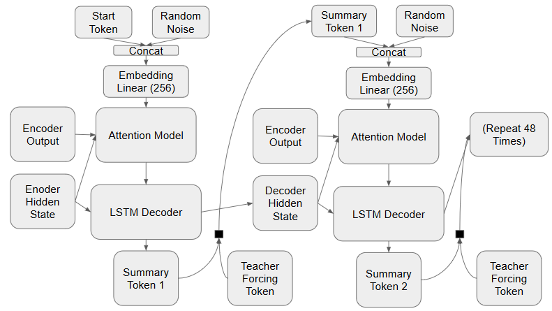
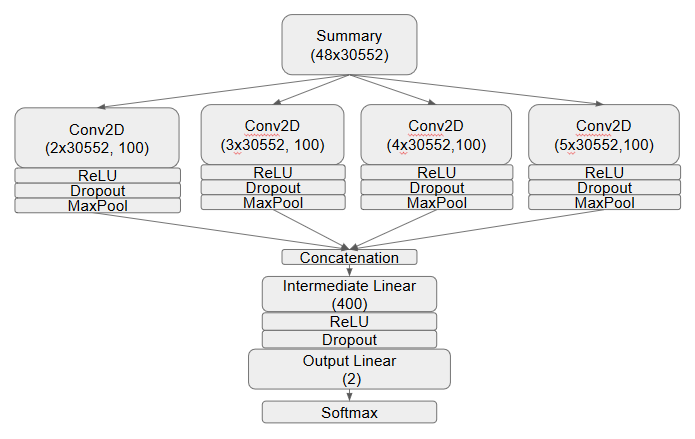
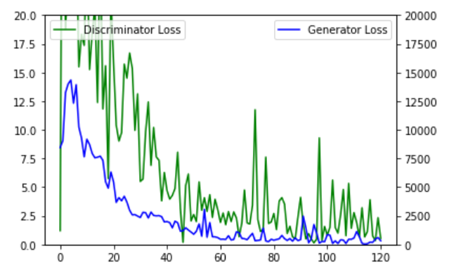
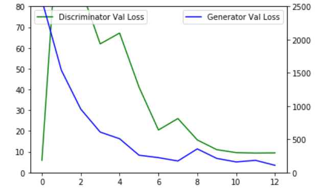

# CNN Text Summarization trained using GAN

Generator Autoencoder Architecture 
(Embedded input token is a BERT embedding) 
Encoder and Attention Head 

Decoder 

 
Discriminator CNN Architecture 

Training Loss
\

Validation Loss
\

